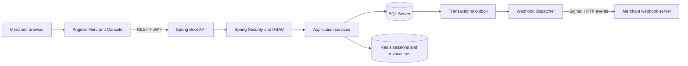
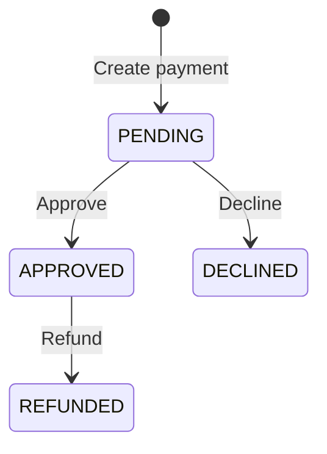

# FinPay

[](https://github.com/orlandosyv/finpay-api/actions/workflows/ci.yml)
[](LICENSE)

FinPay is an educational full-stack payment platform that simulates the core lifecycle of a payment gateway. It combines a Java and Spring Boot REST API with an Angular Merchant Console for operating payments, users, authentication, webhook endpoints, and delivery monitoring.

The project focuses on API design, multi-tenant architecture, authentication and authorization, reliable event delivery, observable operations, automated testing, and containerized infrastructure. It is intended for learning and portfolio demonstration rather than real financial processing.

## Features

- Create and retrieve payments
- Register a merchant with its first administrator account
- Associate users with merchants through explicit roles
- Store passwords as BCrypt hashes instead of plain text
- Authenticate users with signed, short-lived JWT access tokens
- Rotate refresh tokens and revoke sessions with Redis
- Authorize operations with `MERCHANT_ADMIN` and `MERCHANT_USER` roles
- Let administrators create and list users in their own merchant
- Expose the authenticated user and merchant context
- Isolate payment data by the authenticated merchant
- Prevent duplicate payment creation with merchant-scoped idempotency keys
- Register merchant webhook endpoints and deliver signed payment events
- Persist webhook events with a transactional outbox and retry failed deliveries
- Approve or decline pending payments
- Refund approved payments
- Validate amounts and ISO 4217 currency codes: USD, PEN, EUR
- Return consistent `400`, `401`, `403`, `404`, and `409` error responses
- Expose DTOs instead of persistence entities
- Store creation and update timestamps in UTC
- Manage the database schema with versioned Flyway migrations
- Document and test endpoints through Swagger UI
- Run integration tests against real SQL Server and Redis containers
- Start the API, SQL Server, and Redis together with Docker Compose
- Operate FinPay through a responsive Angular Merchant Console
- Register and authenticate merchants from the browser
- Manage payments, merchant users, roles, and webhook destinations visually
- Inspect webhook health, immutable payloads, HTTP responses, failures, and retries
- Automatically attach and refresh JWT credentials from the frontend
- Protect frontend routes according to authentication state and merchant role

## Technology Stack

### Backend

- Java 25
- Spring Boot 4.1.1
- Spring Web MVC
- Spring Data JPA and Hibernate
- Spring Security and OAuth2 Resource Server
- Jakarta Bean Validation
- Flyway
- Springdoc OpenAPI and Swagger UI
- Maven

### Frontend

- Angular 22 with standalone components
- TypeScript 6
- Angular Router with lazy-loaded routes and functional guards
- Angular Signals and Reactive Forms
- Angular HttpClient and HTTP interceptors
- RxJS 7
- SCSS and responsive grayscale UI
- Vitest and Angular HTTP testing utilities

### Data, Infrastructure, and Testing

- Microsoft SQL Server 2022
- Redis 7.4
- Docker and Docker Compose
- JUnit, Mockito, MockMvc, and AssertJ
- Testcontainers for SQL Server and Redis integration tests
- GitHub Actions for backend continuous integration

## Architecture Overview



Angular provides the user-facing workflow, but the API remains the authoritative security boundary. Every protected request is validated independently, and the authenticated JWT determines the current merchant and role. SQL Server stores business state and durable webhook records, while Redis manages refresh-token sessions and access-token revocation.

## Payment Lifecycle



Any transition outside this flow is rejected with `409 Conflict`.

## API Endpoints

| Method   | Endpoint                                            | Description                                                | Required role        | Success status   |
| -------- | --------------------------------------------------- | ---------------------------------------------------------- | -------------------- | ---------------- |
| `GET`    | `/api/health`                                       | Check API availability                                     | Public               | `200 OK`         |
| `POST`   | `/api/auth/register`                                | Register a merchant and its administrator                  | Public               | `201 Created`    |
| `POST`   | `/api/auth/login`                                   | Authenticate and obtain a JWT access token                 | Public               | `200 OK`         |
| `POST`   | `/api/auth/refresh`                                 | Rotate a refresh token and obtain a new token pair         | Public               | `200 OK`         |
| `POST`   | `/api/auth/logout`                                  | Revoke the current session                                 | Either merchant role | `204 No Content` |
| `GET`    | `/api/merchant/me`                                  | Get the authenticated user and merchant context            | Either merchant role | `200 OK`         |
| `GET`    | `/api/merchant/users`                               | List users from the authenticated merchant                 | `MERCHANT_ADMIN`     | `200 OK`         |
| `POST`   | `/api/merchant/users`                               | Create a user in the authenticated merchant                | `MERCHANT_ADMIN`     | `201 Created`    |
| `POST`   | `/api/merchant/webhooks`                            | Register a webhook endpoint and receive its signing secret | `MERCHANT_ADMIN`     | `201 Created`    |
| `GET`    | `/api/merchant/webhooks`                            | List active webhook endpoints                              | `MERCHANT_ADMIN`     | `200 OK`         |
| `DELETE` | `/api/merchant/webhooks/{id}`                       | Disable a webhook endpoint                                 | `MERCHANT_ADMIN`     | `204 No Content` |
| `GET`    | `/api/merchant/webhook-events`                      | List and filter webhook events with pagination             | `MERCHANT_ADMIN`     | `200 OK`         |
| `GET`    | `/api/merchant/webhook-events/summary`              | Get webhook processing health totals                       | `MERCHANT_ADMIN`     | `200 OK`         |
| `GET`    | `/api/merchant/webhook-events/{eventId}`            | Inspect an event and its immutable payload                 | `MERCHANT_ADMIN`     | `200 OK`         |
| `GET`    | `/api/merchant/webhook-events/{eventId}/deliveries` | Inspect the HTTP delivery history for an event             | `MERCHANT_ADMIN`     | `200 OK`         |
| `GET`    | `/api/payments`                                     | List merchant payments                                     | Either merchant role | `200 OK`         |
| `GET`    | `/api/payments/{id}`                                | Find a merchant payment by ID                              | Either merchant role | `200 OK`         |
| `POST`   | `/api/payments`                                     | Create a pending payment using an idempotency key          | Either merchant role | `201 Created`    |
| `PATCH`  | `/api/payments/{id}/approve`                        | Approve a pending payment                                  | `MERCHANT_ADMIN`     | `200 OK`         |
| `PATCH`  | `/api/payments/{id}/decline`                        | Decline a pending payment                                  | `MERCHANT_ADMIN`     | `200 OK`         |
| `PATCH`  | `/api/payments/{id}/refund`                         | Refund an approved payment                                 | `MERCHANT_ADMIN`     | `200 OK`         |

## Running the Backend with Docker

This is the recommended way to run the FinPay API and its dependencies because it requires only Docker Desktop. Docker Compose starts SQL Server and Redis, creates the `finpay_db` database, applies the Flyway migrations, and then starts the API. The Angular development server is started separately.

### Requirements

- Docker Desktop with the Docker engine running
- Available ports `8080`, `1434`, and `6379`, or different ports configured in `.env`

### Start the application

Create your local environment file from the provided template:

```powershell
Copy-Item .env.example .env
```

Open `.env` and replace the example database password with a strong local password. Then generate a 256-bit JWT signing key in PowerShell:

```powershell
$bytes = New-Object byte[] 32
$generator = [Security.Cryptography.RandomNumberGenerator]::Create()
$generator.GetBytes($bytes)
$generator.Dispose()
[Convert]::ToBase64String($bytes)
```

Copy the generated value into `FINPAY_JWT_SECRET`. Never commit the `.env` file.

Build and start the services:

```powershell
docker compose up --build -d
```

Check their status:

```powershell
docker compose ps
```

The API is available at `http://localhost:8080`, SQL Server is exposed on host port `1434`, and Redis is exposed on host port `6379`.

The `sqlserver-init` container is a one-time initialization service. Seeing it with an `Exited (0)` status is expected and means that database creation completed successfully.

### Stop the application

Stop and remove the containers while preserving database data:

```powershell
docker compose down
```

To also delete the SQL Server and Redis volumes, including all stored payments and active authentication sessions:

```powershell
docker compose down -v
```

## Running the Angular Merchant Console

The frontend lives in the `frontend` directory. During local development, Angular runs on port `4200` and proxies every `/api` request to the Spring Boot application on `http://localhost:8080`.

### Requirements

- Node.js `^22.22.3`, `^24.15.0`, or `>=26.0.0`
- npm 8 or newer
- The FinPay backend running on `http://localhost:8080`

Install the frontend dependencies:

```powershell
cd frontend
npm install
```

Start the development server:

```powershell
npm start
```

Open the Merchant Console at `http://localhost:4200`. Angular automatically reloads the application when source files change.

The main frontend routes are:

| Route                 | Description                                         | Access               |
| --------------------- | --------------------------------------------------- | -------------------- |
| `/register`           | Register a merchant and its first administrator     | Public               |
| `/login`              | Authenticate a merchant user                        | Public               |
| `/system/health`      | Check communication with the API                    | Public               |
| `/app/overview`       | View the current user and merchant context          | Authenticated        |
| `/app/payments`       | List, create, and inspect payments                  | Either merchant role |
| `/app/team`           | List users and assign roles during account creation | `MERCHANT_ADMIN`     |
| `/app/webhooks`       | Register and disable webhook destinations           | `MERCHANT_ADMIN`     |
| `/app/webhook-events` | Inspect event health and delivery history           | `MERCHANT_ADMIN`     |

The frontend stores the active token pair in `sessionStorage`, automatically adds the access token to protected API requests, and uses the rotating refresh token when an access token expires. Logging out clears the browser session and asks the API to revoke both credentials.

Payment creation generates an `Idempotency-Key` for each new operation. Retrying the same operation preserves its original request body and key, allowing the API to replay the first response without creating a duplicate payment.

## Swagger and OpenAPI

With the application running, use the interactive documentation at:

- Swagger UI: `http://localhost:8080/swagger-ui.html`
- OpenAPI JSON: `http://localhost:8080/v3/api-docs`

Swagger UI can execute every FinPay endpoint directly from the browser. Register and log in first, copy the returned `accessToken`, select **Authorize**, and paste the token. Swagger adds the `Bearer` prefix automatically.

## Merchant Registration

Registering a merchant creates three related records in a single transaction: the merchant, its first user, and a membership that grants that user the `MERCHANT_ADMIN` role.

```bash
curl -X POST http://localhost:8080/api/auth/register \
  -H "Content-Type: application/json" \
  -d '{"merchantName":"Tienda Andina","email":"admin@tienda.com","password":"StrongPassword123!"}'
```

Example response:

```json
{
  "merchantId": 2,
  "merchantName": "Tienda Andina",
  "userId": 1,
  "email": "admin@tienda.com",
  "role": "MERCHANT_ADMIN"
}
```

Emails are normalized to lowercase and must be unique. Passwords require at least 12 characters, including uppercase and lowercase letters, a number, and a special character. FinPay never returns or stores the original password.

Log in with the registered credentials:

```bash
curl -X POST http://localhost:8080/api/auth/login \
  -H "Content-Type: application/json" \
  -d '{"email":"admin@tienda.com","password":"StrongPassword123!"}'
```

The response contains a signed JWT access token, an opaque refresh token, both expiration periods, the user identity, the merchant context, and the assigned role. Payment endpoints require the access token in the `Authorization` header.

## Token Lifecycle and Logout

Access tokens expire after 15 minutes. Refresh tokens expire after seven days and are stored in Redis only as SHA-256 hashes. The original refresh token is returned to the client and must be protected like a password.

Use the current refresh token to obtain a new token pair:

```bash
curl -X POST http://localhost:8080/api/auth/refresh \
  -H "Content-Type: application/json" \
  -d '{"refreshToken":"<current-refresh-token>"}'
```

Refresh tokens are rotated: a successful refresh consumes the submitted token and returns a new one. Reusing the old token produces `401 Unauthorized`.

Log out with the current access token and latest refresh token:

```bash
curl -X POST http://localhost:8080/api/auth/logout \
  -H "Content-Type: application/json" \
  -H "Authorization: Bearer <current-access-token>" \
  -d '{"refreshToken":"<current-refresh-token>"}'
```

Logout removes the refresh session and stores the JWT identifier in Redis until the access token would naturally expire. This makes both tokens unusable immediately.

## Webhooks

Merchant administrators can register one or more URLs that receive payment lifecycle events. The signing secret is returned only during creation and is encrypted with AES-GCM before it is stored in SQL Server.

```bash
curl -X POST http://localhost:8080/api/merchant/webhooks \
  -H "Content-Type: application/json" \
  -H "Authorization: Bearer <admin-access-token>" \
  -d '{"url":"https://merchant.example.com/webhooks/finpay"}'
```

Example creation response:

```json
{
  "id": 1,
  "url": "https://merchant.example.com/webhooks/finpay",
  "active": true,
  "signingSecret": "<store-this-secret-securely>",
  "createdAt": "2026-09-09T20:00:00Z",
  "updatedAt": "2026-09-09T20:00:00Z"
}
```

FinPay emits `payment.created`, `payment.approved`, `payment.declined`, and `payment.refunded`. Each request includes these headers:

```text
X-FinPay-Event-Id: <unique-event-uuid>
X-FinPay-Event-Type: payment.approved
X-FinPay-Timestamp: <unix-seconds>
X-FinPay-Signature: v1=<hmac-sha256-hex>
```

The signature is `HMAC-SHA256(signingSecret, timestamp + "." + rawRequestBody)`. Receivers should compute the signature over the exact raw JSON body, compare it in constant time, reject stale timestamps, and deduplicate deliveries by `X-FinPay-Event-Id`.

Payment changes and outbox events are committed in the same SQL transaction. A background dispatcher sends pending events every five seconds. Failed deliveries use backoff intervals of 1 minute, 5 minutes, 30 minutes, and 2 hours, then move to `FAILED` after the fifth attempt. Delivery is **at least once**, so receivers must be idempotent.

Local development permits HTTP and private addresses so a receiver can run on the same machine. Production should set `FINPAY_WEBHOOK_REQUIRE_HTTPS=true`, `FINPAY_WEBHOOK_ALLOW_PRIVATE_ADDRESSES=false`, and use a dedicated `FINPAY_WEBHOOK_ENCRYPTION_KEY`.

### Webhook Operations Dashboard API

Merchant administrators can inspect delivery health without accessing SQL Server directly. The dashboard API is read-only and always obtains the merchant identifier from the validated JWT.

List events using optional status, event type, payment, date, and pagination filters:

```bash
curl "http://localhost:8080/api/merchant/webhook-events?status=FAILED&eventType=PAYMENT_REFUNDED&page=0&size=20" \
  -H "Authorization: Bearer <admin-access-token>"
```

The page size must be between 1 and 100. Date filters use inclusive ISO-8601 instants through the `from` and `to` parameters. Event types use the internal enum names `PAYMENT_CREATED`, `PAYMENT_APPROVED`, `PAYMENT_DECLINED`, and `PAYMENT_REFUNDED`; response bodies expose the external names such as `payment.approved`.

Get aggregate processing health:

```bash
curl "http://localhost:8080/api/merchant/webhook-events/summary" \
  -H "Authorization: Bearer <admin-access-token>"
```

The summary returns total, processed, pending, and permanently failed events together with the processed percentage. It separately reports total, successful, and failed HTTP delivery attempts and their success rate. Event detail exposes the exact immutable JSON payload, while the deliveries endpoint returns every destination, attempt number, HTTP status, error, and timestamp. Webhook signing secrets are never exposed by dashboard responses.

## Role-Based Authorization

FinPay uses role-based access control (RBAC) after JWT authentication. Both roles can view the current merchant context and create or retrieve payments. Only `MERCHANT_ADMIN` can approve, decline, or refund payments and manage the merchant team.

An administrator can create an operator without sending a `merchantId`. The API obtains the merchant identifier from the validated JWT, which prevents the client from adding users to another merchant.

```bash
curl -X POST http://localhost:8080/api/merchant/users \
  -H "Content-Type: application/json" \
  -H "Authorization: Bearer <admin-access-token>" \
  -d '{"email":"operator@tienda.com","password":"OperatorPassword123!","role":"MERCHANT_USER"}'
```

The new user can log in through `/api/auth/login` and receives a JWT containing its own user, merchant, and role claims. An operator attempting an administrator-only operation receives `403 Forbidden`.

```json
{
  "timestamp": "2026-09-09T20:00:00Z",
  "status": 403,
  "error": "Forbidden",
  "message": "You do not have permission to access this resource",
  "path": "/api/payments/1/approve"
}
```

## Usage Example

Create a payment:

```bash
curl -X POST http://localhost:8080/api/payments \
  -H "Content-Type: application/json" \
  -H "Authorization: Bearer <access-token>" \
  -H "Idempotency-Key: pay-20260909-0001" \
  -d '{"amount":125.50,"currency":"PEN"}'
```

`Idempotency-Key` is required, must not be blank, and may contain up to 128 characters. Retrying the same merchant, key, and normalized request returns the original `201 Created` response with `Idempotency-Replayed: true` and does not create another payment. The first response contains `Idempotency-Replayed: false`. Reusing the key with different payment data returns `409 Conflict`. Keys are isolated by merchant, so two merchants may safely use the same value.

Example response:

```json
{
  "id": 1,
  "amount": 125.5,
  "currency": "PEN",
  "status": "PENDING",
  "createdAt": "2026-09-07T20:00:00Z",
  "updatedAt": "2026-09-07T20:00:00Z"
}
```

Approve and then refund the payment:

```bash
curl -X PATCH http://localhost:8080/api/payments/1/approve \
  -H "Authorization: Bearer <access-token>"
curl -X PATCH http://localhost:8080/api/payments/1/refund \
  -H "Authorization: Bearer <access-token>"
```

## Validation and Error Responses

A payment amount must be positive, contain no more than two decimal places, and fit within the configured database precision. Currency must be a non-empty, uppercase ISO 4217 code such as `PEN`, `USD`, or `EUR`.

Invalid input produces a structured `400 Bad Request` response:

```json
{
  "status": 400,
  "error": "Bad Request",
  "message": "Request validation failed",
  "fieldErrors": {
    "amount": "Amount must be greater than zero",
    "currency": "Currency must be a valid uppercase ISO 4217 code"
  }
}
```

Missing or invalid tokens return a structured `401 Unauthorized` response. Missing payments return `404 Not Found`, while invalid lifecycle transitions return `409 Conflict`.

```json
{
  "timestamp": "2026-09-09T18:00:00Z",
  "status": 401,
  "error": "Unauthorized",
  "message": "Authentication is required or the access token is invalid",
  "path": "/api/payments"
}
```

## Running the Tests

### Backend tests

Make sure Docker Desktop is running, then execute:

```powershell
.\mvnw.cmd test
```

The test suite includes:

- Payment domain and timestamp tests
- DTO mapper tests
- Service tests with Mockito
- Controller and validation tests with MockMvc
- Full payment lifecycle integration tests
- Merchant registration and membership integration tests
- JWT signature, login, protected endpoint, and tenant-isolation tests
- Role authorization, merchant team management, and forbidden-operation tests
- Refresh-token rotation, reuse prevention, logout, and access-token revocation tests
- Idempotent payment creation, conflict, tenant isolation, and concurrent-retry tests
- Signed webhook delivery, encrypted secrets, tenant isolation, RBAC, and retry tests
- Webhook dashboard summary, filtering, pagination, detail, delivery history, and tenant-isolation tests
- Flyway and SQL Server integration tests with Testcontainers
- OpenAPI and Swagger endpoint checks

Testcontainers creates isolated SQL Server and Redis instances for integration tests and removes them when the test run finishes. No permanent test database or Redis instance is required.

### Frontend tests

From the `frontend` directory, run the Angular test suite once:

```powershell
npm test -- --no-watch --no-progress
```

The frontend tests cover:

- Authentication API contracts and per-tab token storage
- JWT attachment, refresh rotation, retry behavior, and logout
- Authentication and administrator route guards
- Merchant registration and validation errors
- Payment creation, idempotent retries, lifecycle actions, and role restrictions
- Merchant user listing, role assignment, and duplicate-email errors
- Webhook endpoint creation, one-time secret handling, validation, and disabling
- Dashboard summaries, event filters, date validation, immutable payloads, and delivery attempts

Create a production frontend bundle with:

```powershell
npm run build
```

The optimized output is written to `frontend/dist/frontend`.

## Running without Docker Compose

To run the API directly from PowerShell, first create a local SQL Server database named `finpay_db`, start Redis on port `6379`, and provide the database credentials:

```powershell
$env:FINPAY_DB_USERNAME="sa"
$env:FINPAY_DB_PASSWORD="your-local-password"
$bytes = New-Object byte[] 32
$generator = [Security.Cryptography.RandomNumberGenerator]::Create()
$generator.GetBytes($bytes)
$generator.Dispose()
$env:FINPAY_JWT_SECRET=[Convert]::ToBase64String($bytes)
.\mvnw.cmd spring-boot:run
```

The default local JDBC configuration connects to SQL Server at `127.0.0.1:1433`. Flyway applies the required migrations automatically when the application starts.

## Project Structure

```text
src/main/java/com/finpay/api
|-- config/       OpenAPI, password, JWT, security, and scheduling configuration
|-- context/      Authenticated merchant resolution
|-- controller/   REST endpoints
|-- dto/          Request and response contracts
|-- exception/    Domain exceptions and centralized error handling
|-- mapper/       Entity-to-DTO mapping
|-- model/        Payment entity and status model
|-- repository/   Database access
|-- service/      Payment lifecycle business rules
`-- validation/   Custom currency validation

src/main/resources
|-- db/migration/ Versioned Flyway SQL scripts
`-- application.properties

src/test/java/com/finpay/api
|-- controller/   MockMvc tests
|-- mapper/       Mapper tests
|-- model/        Domain tests
|-- service/      Mockito unit tests
`-- ...           SQL Server and end-to-end integration tests

frontend/src/app
|-- core/
|   |-- api/      Typed REST API services
|   |-- auth/     Session state, JWT interceptors, and route guards
|   `-- models/   TypeScript request and response contracts
|-- features/
|   |-- auth/     Login and merchant registration
|   |-- payments/ Payment list, creation, detail, and lifecycle actions
|   |-- session/  Authenticated merchant overview
|   |-- team/     Merchant users and role assignment
|   |-- webhooks/ Endpoint configuration and delivery dashboard
|   `-- system/   Public API health check
|-- layout/       Authenticated Merchant Console shell
`-- shared/       Reusable styles, errors, and presentation components
```

## Design Decisions

- **Response DTOs:** persistence entities are not exposed directly, keeping the public API contract explicit and stable.
- **Centralized error handling:** validation, missing resources, and business conflicts use predictable response structures.
- **Flyway migrations:** schema evolution is versioned and repeatable instead of being generated automatically by Hibernate.
- **UTC timestamps:** payment dates are stored as instants to avoid server-local timezone ambiguity.
- **Real database tests:** Testcontainers verifies behavior against SQL Server rather than an incompatible in-memory substitute.
- **Transactional registration:** merchant, user, and administrator membership are created atomically, so partial registrations cannot remain in the database.
- **Password hashing:** user passwords are encoded with BCrypt and are never exposed through response DTOs.
- **Stateless authentication:** Spring Security validates a signed JWT on every protected request without storing HTTP sessions.
- **Short-lived credentials:** access tokens expire after 15 minutes, limiting the useful lifetime of a leaked JWT.
- **Refresh-token rotation:** every refresh token is single-use and only its SHA-256 hash is retained in Redis.
- **Immediate logout:** revoked JWT identifiers remain in Redis only until their original expiration time.
- **Role-based authorization:** service methods use `@PreAuthorize` so sensitive business operations require `MERCHANT_ADMIN`, while operators receive only the permissions they need.
- **Tenant isolation:** the current merchant comes from the validated token, and payment and membership queries always filter by `merchant_id`.
- **Server-controlled membership:** merchant administration requests never accept a `merchantId`; users are always created inside the authenticated administrator's merchant.
- **Merchant-scoped idempotency:** payment retries use a unique `(merchant_id, idempotency_key)` database constraint. A canonical request hash detects unsafe key reuse, while a transaction commits the payment and its response snapshot atomically.
- **Concurrency safety:** competing requests cannot both create a payment. The database chooses one winner and later requests replay the stored creation response.
- **Transactional outbox:** every payment change and its webhook event commit together in SQL Server, avoiding lost notifications if the HTTP destination is temporarily unavailable.
- **Signed delivery:** webhook secrets are encrypted at rest and used to authenticate payloads with HMAC-SHA256.
- **At-least-once retries:** failed deliveries are persisted and retried with backoff; consumers deduplicate by event ID.
- **Multi-stage Docker build:** Maven compiles the application in a build image, while the final image contains only the Java runtime and packaged application.
- **Feature-oriented frontend:** Angular code is organized around user-facing capabilities while shared API, authentication, and model concerns remain centralized.
- **Frontend defense in depth:** route guards and role-aware controls improve the user experience, while Spring Security remains the authoritative permission boundary.
- **Automatic token renewal:** an HTTP interceptor refreshes expired access tokens and retries the original request without dropping business headers such as `Idempotency-Key`.
- **One-time secret handling:** the Merchant Console displays a newly generated webhook signing secret only from its creation response and never expects it from later list operations.
- **Operational visibility:** the webhook dashboard separates business events from individual HTTP attempts, making retries and destination failures traceable without direct database access.

## Roadmap

The current version includes the backend foundation and a functional Angular Merchant Console. Possible future additions include:

- Invitation-based onboarding and password setup for merchant users
- Role changes, account disabling, and password-reset workflows
- Kafka-based event streaming for higher throughput and multiple consumers
- Structured application metrics, tracing, and production profiles
- Frontend end-to-end tests with Playwright or Cypress
- Containerized frontend deployment with Nginx
- Frontend checks in GitHub Actions

## Instructive Scope

FinPay simulates payment processing for learning and portfolio purposes. It does not connect to banks, card networks, or real payment providers and must not be used to process actual financial transactions.
