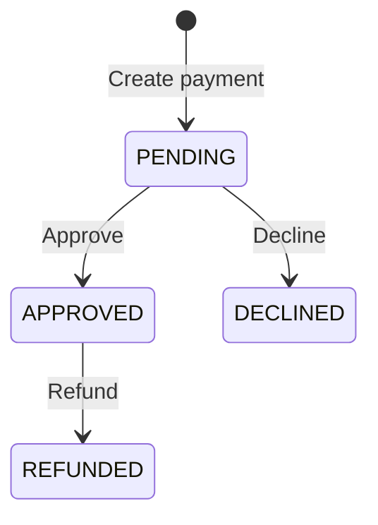

# FinPay API

[](https://github.com/orlandosyv/finpay-api/actions/workflows/ci.yml)
[](LICENSE)

FinPay is an instructive REST API that simulates the core lifecycle of a payment gateway. It provides payment creation, lookup, approval, decline, and refund operations while demonstrating production-oriented backend practices with Java and Spring Boot.

The project focuses on API design, validation, controlled response models, database migrations, automated testing, interactive documentation, and containerized execution.

## Features

- Create and retrieve payments
- Approve or decline pending payments
- Refund approved payments
- Validate amounts and ISO 4217 currency codes: USD, PEN, EUR
- Return consistent `400`, `404`, and `409` error responses
- Expose DTOs instead of persistence entities
- Store creation and update timestamps in UTC
- Manage the database schema with versioned Flyway migrations
- Document and test endpoints through Swagger UI
- Run integration tests against a real SQL Server container
- Start the API and database together with Docker Compose

## Technology Stack

- Java 25
- Spring Boot 4.1.1
- Spring Web MVC
- Spring Data JPA and Hibernate
- Jakarta Bean Validation
- Microsoft SQL Server 2022
- Flyway
- JUnit, Mockito, MockMvc, and AssertJ
- Testcontainers
- Springdoc OpenAPI and Swagger UI
- Maven
- Docker and Docker Compose

## Payment Lifecycle



Any transition outside this flow is rejected with `409 Conflict`.

## API Endpoints

| Method | Endpoint | Description | Success status |
| --- | --- | --- | --- |
| `GET` | `/api/health` | Check API availability | `200 OK` |
| `GET` | `/api/payments` | List all payments | `200 OK` |
| `GET` | `/api/payments/{id}` | Find a payment by ID | `200 OK` |
| `POST` | `/api/payments` | Create a pending payment | `201 Created` |
| `PATCH` | `/api/payments/{id}/approve` | Approve a pending payment | `200 OK` |
| `PATCH` | `/api/payments/{id}/decline` | Decline a pending payment | `200 OK` |
| `PATCH` | `/api/payments/{id}/refund` | Refund an approved payment | `200 OK` |

## Running with Docker

This is the recommended way to run FinPay because it requires only Docker Desktop. Docker Compose starts SQL Server, creates the `finpay_db` database, applies the Flyway migrations, and then starts the API.

### Requirements

- Docker Desktop with the Docker engine running
- Available ports `8080` and `1434`, or different ports configured in `.env`

### Start the application

Create your local environment file from the provided template:

```powershell
Copy-Item .env.example .env
```

Open `.env` and replace the example database password with a strong local password. Never commit this file.

Build and start the services:

```powershell
docker compose up --build -d
```

Check their status:

```powershell
docker compose ps
```

The API is available at `http://localhost:8080` and SQL Server is exposed on host port `1434`.

The `sqlserver-init` container is a one-time initialization service. Seeing it with an `Exited (0)` status is expected and means that database creation completed successfully.

### Stop the application

Stop and remove the containers while preserving database data:

```powershell
docker compose down
```

To also delete the SQL Server volume and all stored payments:

```powershell
docker compose down -v
```

## Swagger and OpenAPI

With the application running, use the interactive documentation at:

- Swagger UI: `http://localhost:8080/swagger-ui.html`
- OpenAPI JSON: `http://localhost:8080/v3/api-docs`

Swagger UI can execute every FinPay endpoint directly from the browser.

## Usage Example

Create a payment:

```bash
curl -X POST http://localhost:8080/api/payments \
  -H "Content-Type: application/json" \
  -d '{"amount":125.50,"currency":"PEN"}'
```

Example response:

```json
{
  "id": 1,
  "amount": 125.50,
  "currency": "PEN",
  "status": "PENDING",
  "createdAt": "2026-09-07T20:00:00Z",
  "updatedAt": "2026-09-07T20:00:00Z"
}
```

Approve and then refund the payment:

```bash
curl -X PATCH http://localhost:8080/api/payments/1/approve
curl -X PATCH http://localhost:8080/api/payments/1/refund
```

## Validation and Error Responses

A payment amount must be positive, contain no more than two decimal places, and fit within the configured database precision. Currency must be a non-empty, uppercase ISO 4217 code such as `PEN`, `USD`, or `EUR`.

Invalid input produces a structured `400 Bad Request` response:

```json
{
  "status": 400,
  "error": "Bad Request",
  "message": "Request validation failed",
  "fieldErrors": {
    "amount": "Amount must be greater than zero",
    "currency": "Currency must be a valid uppercase ISO 4217 code"
  }
}
```

Missing payments return `404 Not Found`, while invalid lifecycle transitions return `409 Conflict`.

## Running the Tests

Make sure Docker Desktop is running, then execute:

```powershell
.\mvnw.cmd test
```

The test suite includes:

- Payment domain and timestamp tests
- DTO mapper tests
- Service tests with Mockito
- Controller and validation tests with MockMvc
- Full payment lifecycle integration tests
- Flyway and SQL Server integration tests with Testcontainers
- OpenAPI and Swagger endpoint checks

Testcontainers creates an isolated SQL Server instance for integration tests and removes it when the test run finishes. No permanent test database is required.

## Running without Docker Compose

To run the API directly from PowerShell, first create a local SQL Server database named `finpay_db` and provide its credentials:

```powershell
$env:FINPAY_DB_USERNAME="sa"
$env:FINPAY_DB_PASSWORD="your-local-password"
.\mvnw.cmd spring-boot:run
```

The default local JDBC configuration connects to SQL Server at `127.0.0.1:1433`. Flyway applies the required migrations automatically when the application starts.

## Project Structure

```text
src/main/java/com/finpay/api
|-- config/       OpenAPI configuration
|-- controller/   REST endpoints
|-- dto/          Request and response contracts
|-- exception/    Domain exceptions and centralized error handling
|-- mapper/       Entity-to-DTO mapping
|-- model/        Payment entity and status model
|-- repository/   Database access
|-- service/      Payment lifecycle business rules
`-- validation/   Custom currency validation

src/main/resources
|-- db/migration/ Versioned Flyway SQL scripts
`-- application.properties

src/test/java/com/finpay/api
|-- controller/   MockMvc tests
|-- mapper/       Mapper tests
|-- model/        Domain tests
|-- service/      Mockito unit tests
`-- ...           SQL Server and end-to-end integration tests
```

## Design Decisions

- **Response DTOs:** persistence entities are not exposed directly, keeping the public API contract explicit and stable.
- **Centralized error handling:** validation, missing resources, and business conflicts use predictable response structures.
- **Flyway migrations:** schema evolution is versioned and repeatable instead of being generated automatically by Hibernate.
- **UTC timestamps:** payment dates are stored as instants to avoid server-local timezone ambiguity.
- **Real database tests:** Testcontainers verifies behavior against SQL Server rather than an incompatible in-memory substitute.
- **Multi-stage Docker build:** Maven compiles the application in a build image, while the final image contains only the Java runtime and packaged application.

## Roadmap

The current version completes the backend foundation. Possible future additions include:

- Authentication and authorization with JWT
- Users and merchant accounts
- Webhooks and idempotency keys
- Asynchronous messaging
- Observability and production profiles
- Angular frontend

## Instructive Scope

FinPay simulates payment processing for learning and portfolio purposes. It does not connect to banks, card networks, or real payment providers and must not be used to process actual financial transactions.
