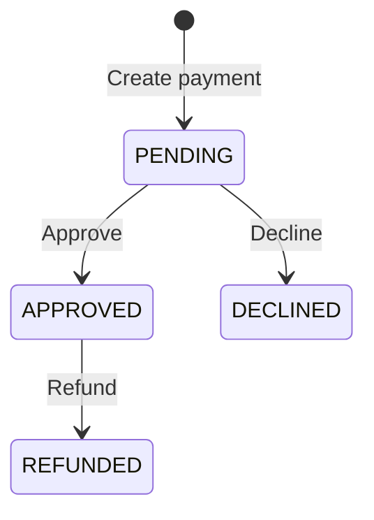

# FinPay API

[](https://github.com/orlandosyv/finpay-api/actions/workflows/ci.yml)
[](LICENSE)

FinPay is an instructive REST API that simulates the core lifecycle of a payment gateway. It provides payment creation, lookup, approval, decline, and refund operations while demonstrating production-oriented backend practices with Java and Spring Boot.

The project focuses on API design, validation, controlled response models, database migrations, automated testing, interactive documentation, and containerized execution.

## Features

- Create and retrieve payments
- Register a merchant with its first administrator account
- Associate users with merchants through explicit roles
- Store passwords as BCrypt hashes instead of plain text
- Authenticate users with signed, one-hour JWT access tokens
- Authorize operations with `MERCHANT_ADMIN` and `MERCHANT_USER` roles
- Let administrators create and list users in their own merchant
- Expose the authenticated user and merchant context
- Isolate payment data by the authenticated merchant
- Approve or decline pending payments
- Refund approved payments
- Validate amounts and ISO 4217 currency codes: USD, PEN, EUR
- Return consistent `400`, `401`, `403`, `404`, and `409` error responses
- Expose DTOs instead of persistence entities
- Store creation and update timestamps in UTC
- Manage the database schema with versioned Flyway migrations
- Document and test endpoints through Swagger UI
- Run integration tests against a real SQL Server container
- Start the API and database together with Docker Compose

## Technology Stack

- Java 25
- Spring Boot 4.1.1
- Spring Web MVC
- Spring Data JPA and Hibernate
- Spring Security and OAuth2 Resource Server
- Jakarta Bean Validation
- Microsoft SQL Server 2022
- Flyway
- JUnit, Mockito, MockMvc, and AssertJ
- Testcontainers
- Springdoc OpenAPI and Swagger UI
- Maven
- Docker and Docker Compose

## Payment Lifecycle



Any transition outside this flow is rejected with `409 Conflict`.

## API Endpoints

| Method | Endpoint | Description | Required role | Success status |
| --- | --- | --- | --- | --- |
| `GET` | `/api/health` | Check API availability | Public | `200 OK` |
| `POST` | `/api/auth/register` | Register a merchant and its administrator | Public | `201 Created` |
| `POST` | `/api/auth/login` | Authenticate and obtain a JWT access token | Public | `200 OK` |
| `GET` | `/api/merchant/me` | Get the authenticated user and merchant context | Either merchant role | `200 OK` |
| `GET` | `/api/merchant/users` | List users from the authenticated merchant | `MERCHANT_ADMIN` | `200 OK` |
| `POST` | `/api/merchant/users` | Create a user in the authenticated merchant | `MERCHANT_ADMIN` | `201 Created` |
| `GET` | `/api/payments` | List merchant payments | Either merchant role | `200 OK` |
| `GET` | `/api/payments/{id}` | Find a merchant payment by ID | Either merchant role | `200 OK` |
| `POST` | `/api/payments` | Create a pending payment | Either merchant role | `201 Created` |
| `PATCH` | `/api/payments/{id}/approve` | Approve a pending payment | `MERCHANT_ADMIN` | `200 OK` |
| `PATCH` | `/api/payments/{id}/decline` | Decline a pending payment | `MERCHANT_ADMIN` | `200 OK` |
| `PATCH` | `/api/payments/{id}/refund` | Refund an approved payment | `MERCHANT_ADMIN` | `200 OK` |

## Running with Docker

This is the recommended way to run FinPay because it requires only Docker Desktop. Docker Compose starts SQL Server, creates the `finpay_db` database, applies the Flyway migrations, and then starts the API.

### Requirements

- Docker Desktop with the Docker engine running
- Available ports `8080` and `1434`, or different ports configured in `.env`

### Start the application

Create your local environment file from the provided template:

```powershell
Copy-Item .env.example .env
```

Open `.env` and replace the example database password with a strong local password. Then generate a 256-bit JWT signing key in PowerShell:

```powershell
$bytes = New-Object byte[] 32
$generator = [Security.Cryptography.RandomNumberGenerator]::Create()
$generator.GetBytes($bytes)
$generator.Dispose()
[Convert]::ToBase64String($bytes)
```

Copy the generated value into `FINPAY_JWT_SECRET`. Never commit the `.env` file.

Build and start the services:

```powershell
docker compose up --build -d
```

Check their status:

```powershell
docker compose ps
```

The API is available at `http://localhost:8080` and SQL Server is exposed on host port `1434`.

The `sqlserver-init` container is a one-time initialization service. Seeing it with an `Exited (0)` status is expected and means that database creation completed successfully.

### Stop the application

Stop and remove the containers while preserving database data:

```powershell
docker compose down
```

To also delete the SQL Server volume and all stored payments:

```powershell
docker compose down -v
```

## Swagger and OpenAPI

With the application running, use the interactive documentation at:

- Swagger UI: `http://localhost:8080/swagger-ui.html`
- OpenAPI JSON: `http://localhost:8080/v3/api-docs`

Swagger UI can execute every FinPay endpoint directly from the browser. Register and log in first, copy the returned `accessToken`, select **Authorize**, and paste the token. Swagger adds the `Bearer` prefix automatically.

## Merchant Registration

Registering a merchant creates three related records in a single transaction: the merchant, its first user, and a membership that grants that user the `MERCHANT_ADMIN` role.

```bash
curl -X POST http://localhost:8080/api/auth/register \
  -H "Content-Type: application/json" \
  -d '{"merchantName":"Tienda Andina","email":"admin@tienda.com","password":"StrongPassword123!"}'
```

Example response:

```json
{
  "merchantId": 2,
  "merchantName": "Tienda Andina",
  "userId": 1,
  "email": "admin@tienda.com",
  "role": "MERCHANT_ADMIN"
}
```

Emails are normalized to lowercase and must be unique. Passwords require at least 12 characters, including uppercase and lowercase letters, a number, and a special character. FinPay never returns or stores the original password.

Log in with the registered credentials:

```bash
curl -X POST http://localhost:8080/api/auth/login \
  -H "Content-Type: application/json" \
  -d '{"email":"admin@tienda.com","password":"StrongPassword123!"}'
```

The response contains a signed JWT access token, the expiration in seconds, the user identity, the merchant context, and the assigned role. Payment endpoints require this token in the `Authorization` header.

## Role-Based Authorization

FinPay uses role-based access control (RBAC) after JWT authentication. Both roles can view the current merchant context and create or retrieve payments. Only `MERCHANT_ADMIN` can approve, decline, or refund payments and manage the merchant team.

An administrator can create an operator without sending a `merchantId`. The API obtains the merchant identifier from the validated JWT, which prevents the client from adding users to another merchant.

```bash
curl -X POST http://localhost:8080/api/merchant/users \
  -H "Content-Type: application/json" \
  -H "Authorization: Bearer <admin-access-token>" \
  -d '{"email":"operator@tienda.com","password":"OperatorPassword123!","role":"MERCHANT_USER"}'
```

The new user can log in through `/api/auth/login` and receives a JWT containing its own user, merchant, and role claims. An operator attempting an administrator-only operation receives `403 Forbidden`.

```json
{
  "timestamp": "2026-09-09T20:00:00Z",
  "status": 403,
  "error": "Forbidden",
  "message": "You do not have permission to access this resource",
  "path": "/api/payments/1/approve"
}
```

## Usage Example

Create a payment:

```bash
curl -X POST http://localhost:8080/api/payments \
  -H "Content-Type: application/json" \
  -H "Authorization: Bearer <access-token>" \
  -d '{"amount":125.50,"currency":"PEN"}'
```

Example response:

```json
{
  "id": 1,
  "amount": 125.50,
  "currency": "PEN",
  "status": "PENDING",
  "createdAt": "2026-09-07T20:00:00Z",
  "updatedAt": "2026-09-07T20:00:00Z"
}
```

Approve and then refund the payment:

```bash
curl -X PATCH http://localhost:8080/api/payments/1/approve \
  -H "Authorization: Bearer <access-token>"
curl -X PATCH http://localhost:8080/api/payments/1/refund \
  -H "Authorization: Bearer <access-token>"
```

## Validation and Error Responses

A payment amount must be positive, contain no more than two decimal places, and fit within the configured database precision. Currency must be a non-empty, uppercase ISO 4217 code such as `PEN`, `USD`, or `EUR`.

Invalid input produces a structured `400 Bad Request` response:

```json
{
  "status": 400,
  "error": "Bad Request",
  "message": "Request validation failed",
  "fieldErrors": {
    "amount": "Amount must be greater than zero",
    "currency": "Currency must be a valid uppercase ISO 4217 code"
  }
}
```

Missing or invalid tokens return a structured `401 Unauthorized` response. Missing payments return `404 Not Found`, while invalid lifecycle transitions return `409 Conflict`.

```json
{
  "timestamp": "2026-09-09T18:00:00Z",
  "status": 401,
  "error": "Unauthorized",
  "message": "Authentication is required or the access token is invalid",
  "path": "/api/payments"
}
```

## Running the Tests

Make sure Docker Desktop is running, then execute:

```powershell
.\mvnw.cmd test
```

The test suite includes:

- Payment domain and timestamp tests
- DTO mapper tests
- Service tests with Mockito
- Controller and validation tests with MockMvc
- Full payment lifecycle integration tests
- Merchant registration and membership integration tests
- JWT signature, login, protected endpoint, and tenant-isolation tests
- Role authorization, merchant team management, and forbidden-operation tests
- Flyway and SQL Server integration tests with Testcontainers
- OpenAPI and Swagger endpoint checks

Testcontainers creates an isolated SQL Server instance for integration tests and removes it when the test run finishes. No permanent test database is required.

## Running without Docker Compose

To run the API directly from PowerShell, first create a local SQL Server database named `finpay_db` and provide its credentials:

```powershell
$env:FINPAY_DB_USERNAME="sa"
$env:FINPAY_DB_PASSWORD="your-local-password"
$bytes = New-Object byte[] 32
$generator = [Security.Cryptography.RandomNumberGenerator]::Create()
$generator.GetBytes($bytes)
$generator.Dispose()
$env:FINPAY_JWT_SECRET=[Convert]::ToBase64String($bytes)
.\mvnw.cmd spring-boot:run
```

The default local JDBC configuration connects to SQL Server at `127.0.0.1:1433`. Flyway applies the required migrations automatically when the application starts.

## Project Structure

```text
src/main/java/com/finpay/api
|-- config/       OpenAPI, password, JWT, and security configuration
|-- context/      Authenticated merchant resolution
|-- controller/   REST endpoints
|-- dto/          Request and response contracts
|-- exception/    Domain exceptions and centralized error handling
|-- mapper/       Entity-to-DTO mapping
|-- model/        Payment entity and status model
|-- repository/   Database access
|-- service/      Payment lifecycle business rules
`-- validation/   Custom currency validation

src/main/resources
|-- db/migration/ Versioned Flyway SQL scripts
`-- application.properties

src/test/java/com/finpay/api
|-- controller/   MockMvc tests
|-- mapper/       Mapper tests
|-- model/        Domain tests
|-- service/      Mockito unit tests
`-- ...           SQL Server and end-to-end integration tests
```

## Design Decisions

- **Response DTOs:** persistence entities are not exposed directly, keeping the public API contract explicit and stable.
- **Centralized error handling:** validation, missing resources, and business conflicts use predictable response structures.
- **Flyway migrations:** schema evolution is versioned and repeatable instead of being generated automatically by Hibernate.
- **UTC timestamps:** payment dates are stored as instants to avoid server-local timezone ambiguity.
- **Real database tests:** Testcontainers verifies behavior against SQL Server rather than an incompatible in-memory substitute.
- **Transactional registration:** merchant, user, and administrator membership are created atomically, so partial registrations cannot remain in the database.
- **Password hashing:** user passwords are encoded with BCrypt and are never exposed through response DTOs.
- **Stateless authentication:** Spring Security validates a signed JWT on every protected request without storing HTTP sessions.
- **Role-based authorization:** service methods use `@PreAuthorize` so sensitive business operations require `MERCHANT_ADMIN`, while operators receive only the permissions they need.
- **Tenant isolation:** the current merchant comes from the validated token, and payment and membership queries always filter by `merchant_id`.
- **Server-controlled membership:** merchant administration requests never accept a `merchantId`; users are always created inside the authenticated administrator's merchant.
- **Multi-stage Docker build:** Maven compiles the application in a build image, while the final image contains only the Java runtime and packaged application.

## Roadmap

The current version completes the backend foundation and begins the multi-merchant phase. Possible future additions include:

- Refresh tokens and token revocation
- Invitation-based onboarding and password setup for merchant users
- Webhooks and idempotency keys
- Asynchronous messaging
- Observability and production profiles
- Angular frontend

## Instructive Scope

FinPay simulates payment processing for learning and portfolio purposes. It does not connect to banks, card networks, or real payment providers and must not be used to process actual financial transactions.
